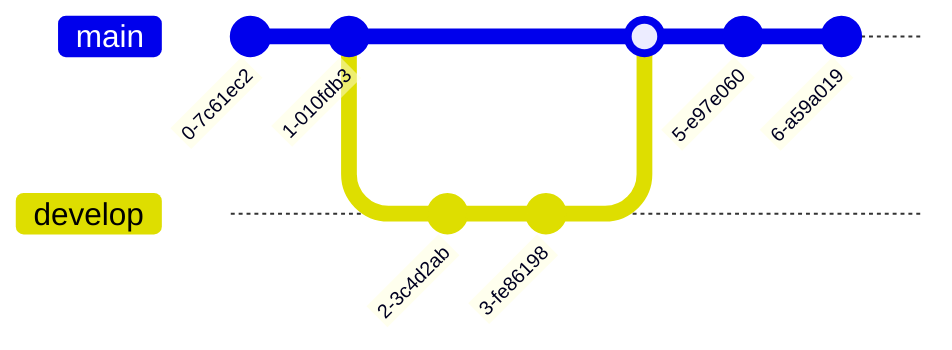

# Curso-Git-GitHub

Curso de Git y GitHub

Mi primera contribución local para GitHub

Un commit más desde GitHub

Una actualizacion para usar git fetch

Cambios desde mi rama local: developer01

Cambios desde GitHub.dev Editor

Presiona <kbd>W</kbd> para ir hacia arriba, presiona <kbd>S</kbd> para ir hacia abajo, <kbd>A</kbd> para la izquierda y <kbd>D</kbd> para la derecha

